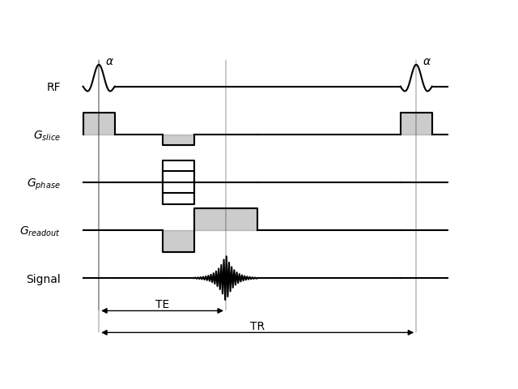

# mrsd: a toolkit to generate MR sequence diagrams

*mrsd* is a Python toolkit to generate MR sequence diagrams, as shown below for the basic [FLASH](https://onlinelibrary.wiley.com/doi/10.1002/mrm.1910030217) sequence -- the full version of the code is available in the *examples* directory.



```python
figure, plot = matplotlib.pyplot.subplots()
diagram = mrsd.Diagram(
    plot, ["RF", "$G_{slice}$", "$G_{phase}$", "$G_{readout}$", "Signal"])

# Slice-selective pulse of the first TR
diagram.sinc_pulse("RF", *pulses[0], 1)
diagram.gradient("$G_{slice}$", *pulses[0], G_slice[0])
diagram.idle(["$G_{phase}$", "$G_{readout}$", "Signal"], *pulses[0])

# Dead time until the start of encoding
diagram.idle_all(pulses[0][1], encoding[0])

# Encoding: rewind slice-selection gradient, run phase gradient, prephase
# read-out gradient
diagram.gradient("$G_{slice}$", *encoding, G_slice[1])
diagram.stepped_gradient("$G_{phase}$", *encoding, 1)
diagram.gradient("$G_{readout}$", *encoding, G_readout[1])
diagram.idle(["RF", "Signal"], *encoding)

# Readout, centered on TE
diagram.gradient("$G_{readout}$", *readout, G_readout[0])
diagram.echo("Signal", *readout, +1)
diagram.idle(["RF", "$G_{slice}$", "$G_{phase}$"], *readout)

# Idle until end of TR
diagram.idle_all(readout[1], pulses[1][0])

# Start of next TR
diagram.sinc_pulse("RF", *pulses[1], 1)
diagram.gradient("$G_{slice}$", *pulses[1], G_slice[0])
diagram.idle(["$G_{phase}$", "$G_{readout}$", "Signal"], *pulses[1])

# Add annotations: flip angles and TE/TR intervals
diagram.annotate("RF", 0.2, r"$\alpha$", 1)
diagram.annotate("RF", TR+0.2, r"$\alpha$", 1)
diagram.interval(0, TE, -1.5, "TE")
diagram.interval(0, TR, -2.5, "TR")
```

*mrsd* is available on [PyPi](https://pypi.org/project/mrsd/). To install from source, the only dependencies are [Matplotlib](https://matplotlib.org/) and [numpy](https://numpy.org/).
