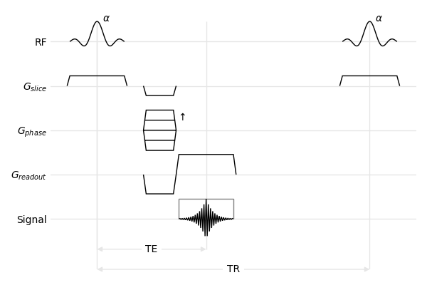

# mrsd: MR sequence diagrams in Python

*mrsd* is a Python toolkit to generate MR sequence diagrams, available on [PyPi](https://pypi.org/project/mrsd/). To install from source, the only dependencies are [Matplotlib](https://matplotlib.org/) and [numpy](https://numpy.org/).

To get started, have a look at the tutorials ([FLASH](https://mrsd.readthedocs.io/en/latest/flash/index.html) and [multi-echo FLASH](https://mrsd.readthedocs.io/en/latest/multiecho/index.html) and the [examples](https://github.com/lamyj/mrsd/tree/master/examples). Once familiar with the basic concepts, you can find more details in the [API Documentation](https://mrsd.readthedocs.io/en/latest/api/index.html).

Rather use MATLAB than Python? [mrisd](https://github.com/benoitberanger/mri_seq_diagram_matlab) is the answer!

