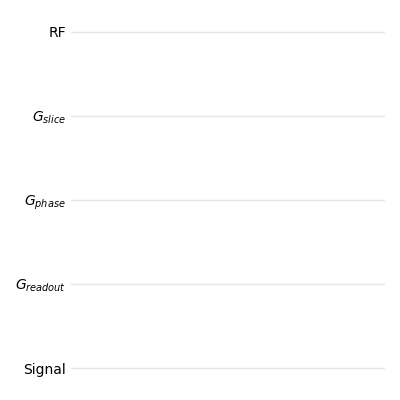
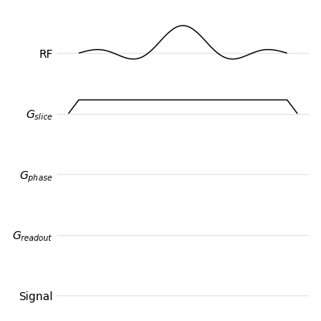
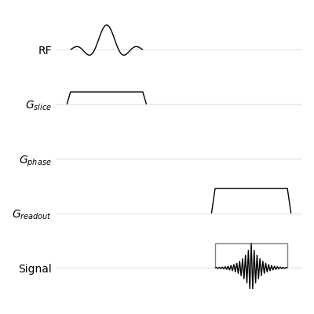
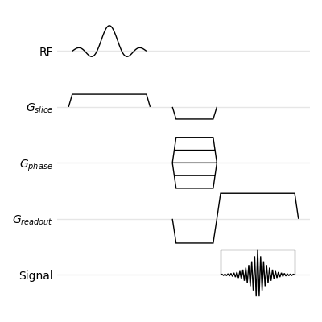
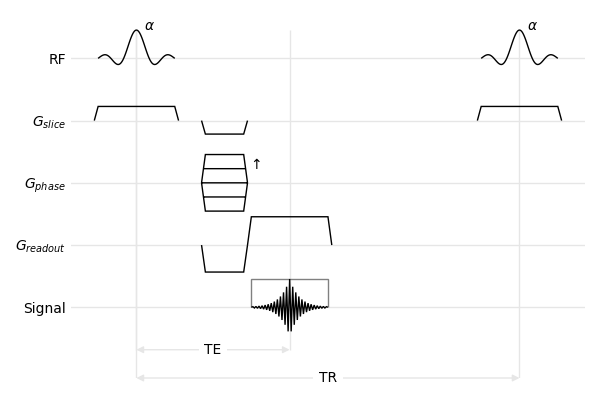

FLASH Tutorial
==============

This example shows how to draw the sequence diagram of the 2D FLASH sequence, as show, in `FLASH imaging. Rapid NMR imaging using low flip-angle pulses <https://doi.org/10.1016/0022-2364(86)90433-6>`_, Haase et al., Journal of Magnetic Resonance, 67(2), pp. 258-266, 1986.

Start by creating two matplotlib objects, a `figure and a plot <https://matplotlib.org/stable/api/_as_gen/matplotlib.pyplot.subplots.html>`_, then create an empty sequence diagram which will be drawn in the matplotlib plot. The second argument is a list of *channels*: horizontal time lines for the various sequence events. Channel names may contain math expression inside dollar characters: they will be interpreted according to LaTeX rules. Channel names are arbitrary, and carry no specific meaning.

.. literalinclude:: figures.py
   :lines: 1-6

    
   Empty sequence diagram

Slice-selective Pulse
---------------------

The 2D FLASH sequence starts with a slice-selective RF pulse, i.e. an RF pulse played concurrently with a gradient on the slice axis.

Within *mrsd*, everything that happens during a sequence (RF pulses, gradients, echoes, etc.) is called an *event*. Each event has a duration and a position in time, which can be specified by the ``begin``, ``end`` or ``center`` of the event. This can be used to synchronize events: the RF pulse is centered on 0, and the slice-selection gradient is centered on the RF pulse.

We start by creating the :class:`~mrsd.RFPulse` with a duration of 2 (time units are arbitrary), and an amplitude of 1 (amplitudes of events are normalized between -1 and 1). We then create the :class:`~mrsd.Gradient`, with a flat-top centered on the pulse, and an amplitude of 0.5. Once created, those two objects are added (:func:`~mrsd.Diagram.add`) to their respective channels. 

.. literalinclude:: figures.py
   :lines: 16-20

It is also possible to directly add object to the diagram by calling the appropriate functions of the :class:`~mrsd.Diagram` class: :func:`~mrsd.Diagram.rf_pulse` and :func:`~mrsd.Diagram.gradient`.

.. literalinclude:: figures.py
   :lines: 26-28

Ramp times can be added to the gradients, using either the ``ramp`` parameter (symmetric ramp-up and ramp-down times), or both the ``ramp_up`` and ``ramp_down`` parameters (asymmetric gradients). These parameters can be used in both forms of gradient creation.

Since selective pulses are a common pattern, a convenience function (:func:`~mrsd.Diagram.selective_pulse`) exists to create both objects:

.. literalinclude:: figures.py
   :lines: 34-35

   
   Slice-selective pulse

The envelope of RF-pulses can be tuned using the ``envelope`` parameter: it defaults to ``sinc``, but ``box`` or ``gaussian`` can also be used. You can also use the convenience functions :func:`~mrsd.Diagram.sinc_pulse`, :func:`~mrsd.Diagram.hard_pulse`, and :func:`~mrsd.Diagram.gaussian_pulse` of the :class:`~mrsd.Diagram` objects.

Readout
-------

The readout occurs at echo time, and comprises three events: the :class:`~mrsd.ADC` being switched on and off, the :class:`~mrsd.Echo`, and the readout gradient. As for the selective pulse, the objects can be created then added to the diagram. Note that the ADC object takes an extra parameter, ``ec``: this is passed to `matplotlib <https://matplotlib.org/stable/api/_as_gen/matplotlib.patches.Patch.html>`_ and can be used to change the aspect of the drawn object (color, line style, transparency, etc.).

.. literalinclude:: figures.py
   :lines: 43-52

The readout events can also be added using functions from the :class:`~mrsd.Diagram` class: :func:`~mrsd.Diagram.adc` and :func:`mrsd.Diagram.echo`.

.. literalinclude:: figures.py
   :lines: 56-59

As for the selective pulse, the readout is a common pattern for which a convenience function (:func:`~mrsd.Diagram.readout`) can create all three events.

.. literalinclude:: figures.py
   :lines: 63-65

   
   Pulse and readout

Encoding Gradients
------------------

The phase-encoding gradient is displayed as overlayed gradient lobes to represent the different repetitions of the sequence: in *mrsd*, this is called a :class:`~mrsd.MultiGradient`.

.. literalinclude:: figures.py
   :lines: 73-76

As for the other events, it can be directly added using a function from the :class:`~mrsd.Diagram` class (:func:`~mrsd.Diagram.multi_gradient`).

.. literalinclude:: figures.py
   :lines: 80

The prephasing lobe of the readout gradient depends on the readout gradient itself: its area must be minus one-half that of the main readout lobe. :class:`~mrsd.Gradient` events have an :func:`~mrsd.Gradient.adapt` function which create a new gradient from an existing one and an area ratio.

.. literalinclude:: figures.py
   :lines: 82-83

Similarly, the slice-encoding gradient must be rewound.

.. literalinclude:: figures.py
   :lines: 85-87

   
   Pulse, readout, and encoding gradients

Annotations and Copies
----------------------

The sequence diagram can be supplemented with annotations for a better understanding of the sequence. Time intervals (:func:`~mrsd.Diagram.interval`) can show the TE and TR.

.. literalinclude:: figures.py
   :lines: 95-98

Channel specific annotations (e.g. flip angles and direction of phase encoding) are added using :func:`~mrsd.Diagram.annotate`.

.. literalinclude:: figures.py
   :lines: 100-101

Finally, we show the beginning of the next repetition by creating copies of the RF pulse and the slice-selection gradient and moving them by the value of TR (:func:`~mrsd.Event.move`).

.. literalinclude:: figures.py
   :lines: 105-107

   
   Full diagram of the FLASH sequence
