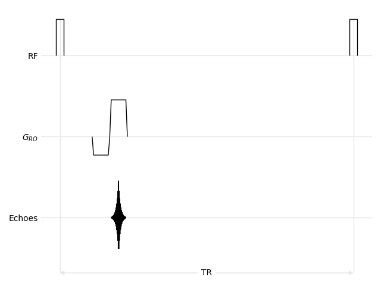
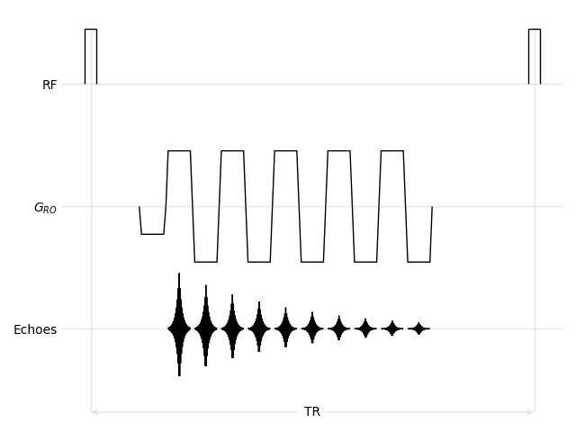
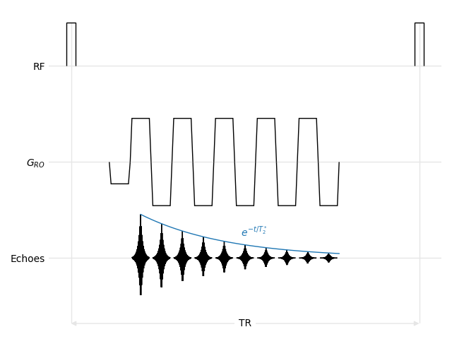

Multi-Echo FLASH Tutorial
=========================

This tutorial extends the :doc:`../flash/index` to show a more complex readout pattern with alternating polarities and how to add other matplotlib objects to a sequence diagram.

We will start from a simple diagram with only three channels, the RF pulses, the readout gradient and the echoes.

.. literalinclude:: figures.py
    :lines: 1-8

We will then define sequence parameters, add the RF pulse and show the TR. Note that this diagram uses a rectangular pulse instead of a sinc one.

.. literalinclude:: figures.py
    :lines: 10-17

We then add the first echo, its readout gradient and the prephasing lobe of the readout gradient. In this example, we do not show the ADC to make the diagram more readable.

.. literalinclude:: figures.py
    :lines: 19-22

This part is very similar to the :doc:`../flash/index` and yields the following diagram.

    
    Single echo

Multiple Echoes
---------------

In this tutorial, the sequence uses bipolar readout gradients and echoes as close as possible with respect to the gradient ramps. This means that the beginning of a readout gradient is the end of a previous one, and that the center of each echo is located at the center of its corresponding gradient lobe. We also modulate the echo amplitudes with a :math:`T_2^*` decay.

.. literalinclude:: figures.py
    :lines: 26-34

    
    Multiple echoes

T₂* Decay
---------

Finally, we show a continuous :math:`T_2^*` decay curve overlayed on top of the echoes. This is achieved by calling the usual matplotlib functions of the ``plot`` object, with the curve beginning at the first echo located at ``TE`` and ending at the last echo, using the last ``readout`` object. The vertical position must set to the RF channel, which can be accessed using the :func:`~mrsd.Diagram.y` function of the :class:`~mrsd.Diagram` class.

.. literalinclude:: figures.py
    :lines: 38-41

    
    Multiple echoes and overlayed T₂* decay
